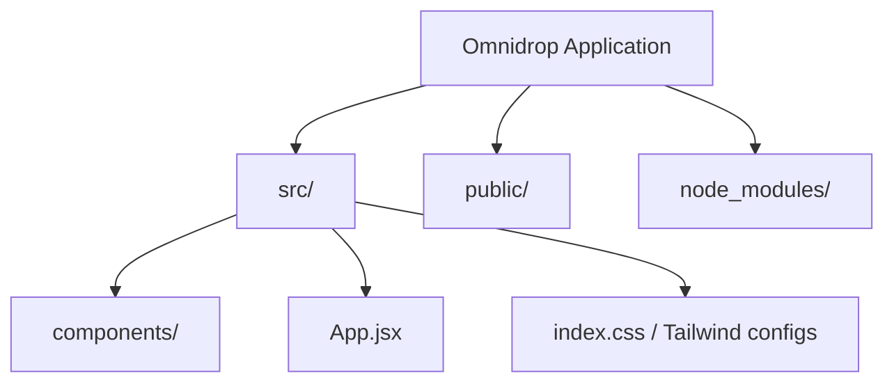

# 📌 Omnidrop


Omnidrop is a **modern React application** built with Vite and styled with Tailwind CSS.
It features smooth scroll animations with AOS and presents sleek UI/UX design elements.

🌐 **Live Demo:** [Visit Omnidrop](https://inaumanmajeed.github.io/Omnidrop/)

---

## ⚡ Tech Stack

* **React** (with Vite) – for fast development & modern component-based UI
* **Tailwind CSS** – utility-first styling for responsive design
* **AOS (Animate On Scroll)** – animated scroll interactions
* **GitHub Pages** – hosting platform

---

## 🚀 Getting Started

### 🔹 Run Locally

1. Clone the repository:

   ```bash
   git clone https://github.com/inaumanmajeed/Omnidrop.git
   cd Omnidrop
   ```

2. Install dependencies:

   ```bash
   npm install
   ```

3. Start the development server:

   ```bash
   npm run dev
   ```

---

## 📈 Roadmap / Improvements

* [ ] Refine animations for smoother transitions
* [ ] Improve mobile responsiveness and layout adjustments
* [ ] Add accessibility improvements (keyboard nav, aria labels)
* [ ] Lazy load images & optimize bundle size
* [ ] Add more interactive components

---

## 🤝 Contribution Guide

1. Fork the repo
2. Create your branch (`feature-new`)
3. Commit changes
4. Push to branch
5. Open Pull Request

---

## 📜 License

This project is licensed under the [MIT License](./LICENSE).

---

## 👨‍💻 Author

**Nauman Majeed**
[](https://github.com/inaumanmajeed)
[](https://www.linkedin.com/in/inaumanmajeed/)

---

# 📊 Visual Overview


